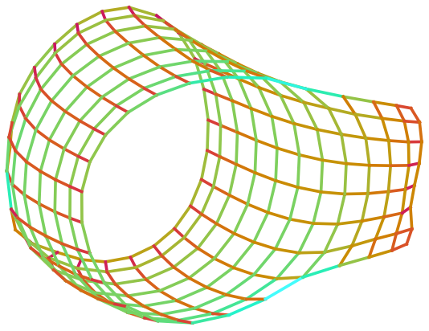
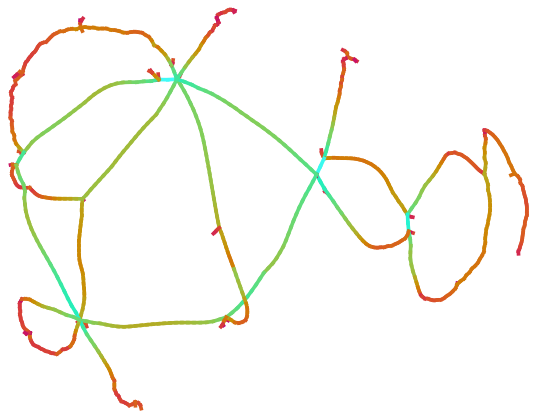

## `visla`
Easy and attractive visualizations of sparse matrices and graphs.

### Samples




### Usage
`visla` is a command line program to visualize graphs in 2D in the style of [Yifan Hu's Gallery of Large Graphs](https://people.engr.tamu.edu/davis/matrices.html).

The two figures above were generated with (respectively)
```
$ visla grid1_dual.mtx
$ visla M10PI_n.mtx
```

For now it takes [SuiteSparse](https://sparse.tamu.edu/)/[MatrixMarket](https://math.nist.gov/MatrixMarket/) standard `.mtx` files as input.

If you want more fine grained control, use the `visla.VGraph` class (documentation below) in a Python program.


### Installation
Once you've obtained the source code for this repository, you can install it as a local package via
```
pip install -e .
```

### Documentation
The `visla` command line program has a help message; the rest of this section is dedivated to highlighting the `visla.VGraph` class.
The user is encouraged to read the source code as necessary.

This is powered by an extension of [PyGraphviz's](https://pygraphviz.github.io/documentation/stable/) `AGraph` class.
Specifically, the following methods and fields have been added:
- `from_mtx()`: read in graph from a `.mtx` file (the SuiteSparse/MatrixMarket standard)
- `mm_vis()`: visualize a laid out graph in the style of [Yifan Hu's Gallery of Large Graphs](https://people.engr.tamu.edu/davis/matrices.html), can create and show its own figure, or may be called as `mm_vis(fig,ax)` if you want control of the figure (for example to use `savefig()`
- `bg_color`: color of background
- `cm`: color map for edge length

For now, see `bin/visla` to see how some of these options are used.


## Notes

I suggest using some sort of "SuiteSparse-getter" like [`ssgetpy`](https://github.com/drdarshan/ssgetpy) (available via pip) to retrieve `.mtx` files before feeding them to `visla`.

A few `.mtx` files are included: `will57.mtx` is small and good for prototyping, `grid1_dual.mtx` and `M10PI_n.mtx` are used to generate the figures above.


### Sources

The pipeline to create these visualization was informed by the following:

- [Yifan Hu's Gallery of Large Graphs](https://people.engr.tamu.edu/davis/matrices.html)
- [Tim Davis's synopsis of how Yifan Hu generated his figures](https://people.engr.tamu.edu/davis/matrices.html)


### Limitations
- The parsers implemented inside of this project were hacked together and made to work on practical examples.
  I don't know of any cases in which they fail, but I'm sure they exist.
- One of said parsers is made irrelevant by `scipy.io.mmread()`, which should be an easy swap.
- Right now, the command line program `visla` only accepts `.mtx` files as input.
  This would be a nice thing to expand (a trivial first start would be to use the capability `pygraphviz.AGraph(<DOT file>)` to allow `visla` to read and render DOT files).
  Meanwhile, the class `VGraph` can visualize anything you can feed to `PyGraphviz`.

